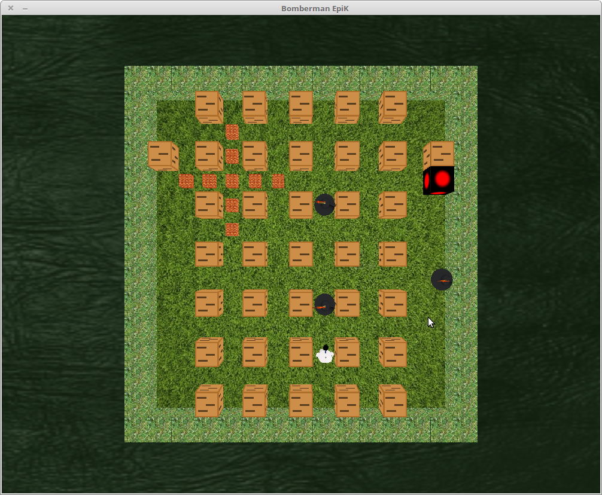

   *-------------------------*
  /     Bomberman 2014 !!     \
 +_____________________________+

 // the project | le projet
 ------------------------------
	-> the goal was to recreate the bomberman game with the GDL,
	a graphic library made by my school {EPITEC}.
	-> le but de ce projet etait de recréer un Bomberman, le jeu,
	avec la GDL, la bibliotheque graphic de mon ecole {EPITECH}

 // How to use it | comment le faire focntionner
 --------------------------------------------------
	-> after cloning or download a zip file, you have to compile it
	with the command 'make', and after you have to add an environment
	variable : LD_LIBRARY_PATH=./libs
	and you execute with the cmd : ./Bomberman
	there is only one option when you execute it, it is -v that stop
	the video at the begining
	nb: it is for Linux only ..
	-> apres avoir clonné le depot ou telecharger un fichier zip
	vous pouvez compiler le projet avec la commande 'make'
	et apres vous ajouter la variable d'envirronnement :
	   	      	      	 	  LD_LIBRARY_PATH=./libs
	puis vous pouvez l'executer avec la commande : ./Bomberman
	il existe une option: -v, qui stop la video d'intro
	nb: ca ne fonctionne que pour linux ..

  _____________
 /screenshots  /
---------------

	

	

 ((i'm going to add details))